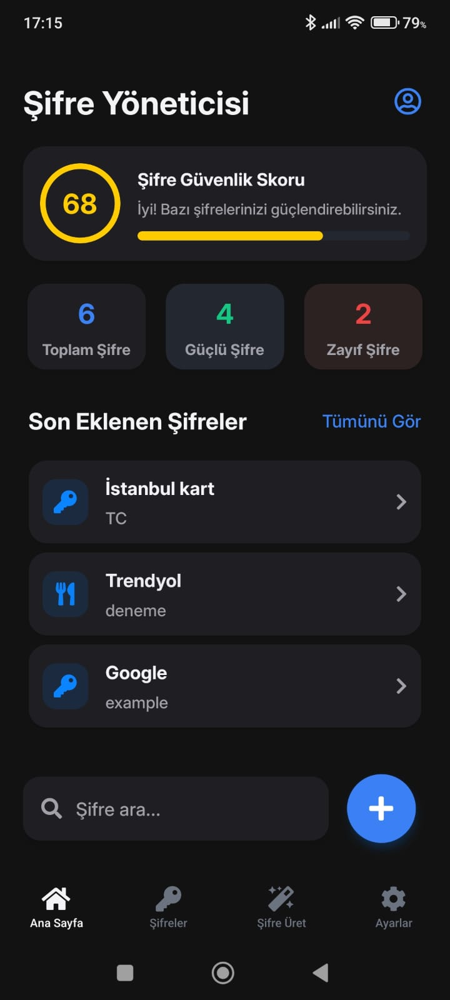
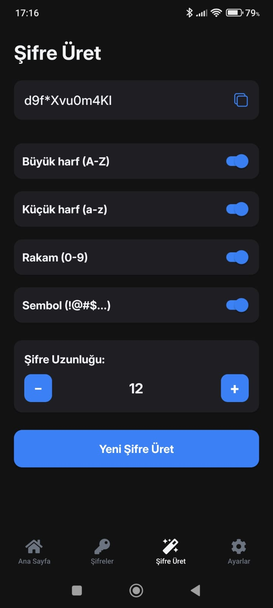
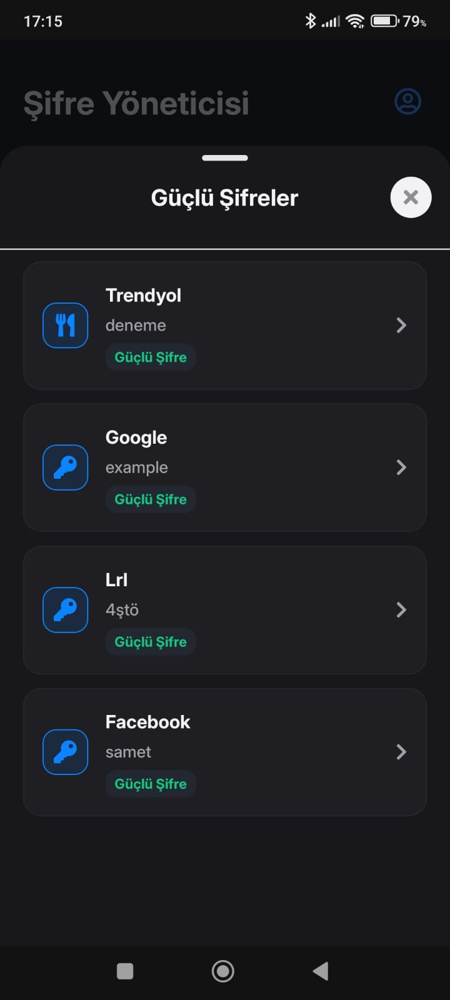
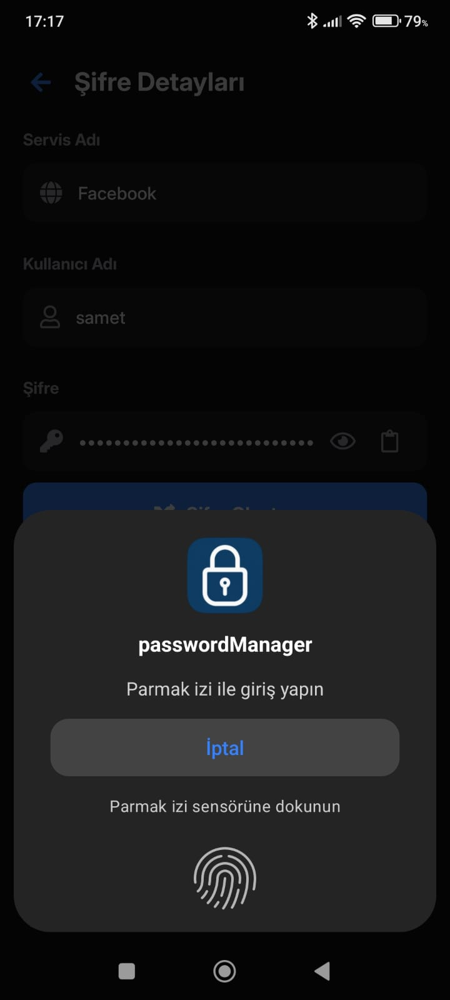
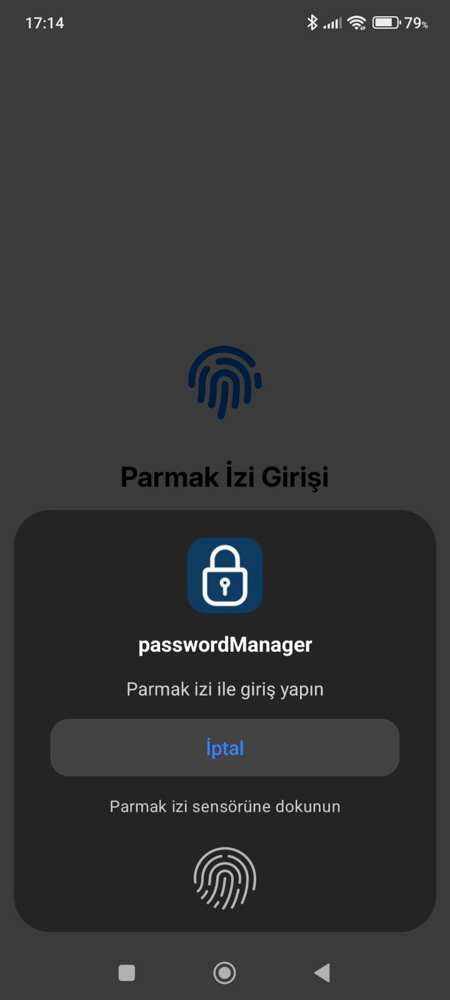

# 🔐 Password Manager (React Native + Expo)

A simple and secure password manager built with **React Native** and **Expo**.  
Store your passwords safely, protect access with fingerprint authentication,  
and generate strong passwords instantly.

---

## 🚀 Features

- 🧠 **Secure Password Storage** — Save and manage all your passwords locally.  
- 🔒 **Fingerprint Protection** — Biometric authentication for secure access.  
- ⚙️ **Random Password Generator** — Create strong and unique passwords in one tap.  
- 📊 **Password Strength Score** — Instantly see how strong your password is.  
- 💾 **Clean & Simple UI** — Minimal, user-friendly interface.

---

## 🛠️ Technologies Used

- **React Native**
- **Expo**
- **AsyncStorage** (for local data storage)
- **Expo Local Authentication**
- **Custom password strength algorithm**

---

<h2 align="center">📱 App Screenshots</h2>

  
  

  
  

  
  

  

